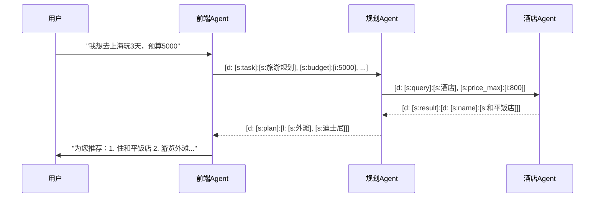

### AICL协议极简使用教程  
**只需3步，让您的Agent/LM获得精确通信能力**

#### 一、适用场景（什么时候用？）
1. **Agent间协作**  
   - 多智能体任务分配（如：规划Agent → 执行Agent）
   - 联邦学习参数交换
2. **工具调用**  
   - 精确调用API/函数（带结构化参数）
   - 处理图像/张量等二进制数据
3. **自动化流程**  
   - 工作流引擎与LLM的通信
   - 避免自然语言歧义的关键操作

#### 二、配置方法（怎么启用？）
**只需1次操作**：将Prompt复制到Agent的System Prompt区域  

> ✅ **配置位置示例**：  
> - OpenAI API：`messages=[{"role":"system", "content":"(上述Prompt)"}]`  
> - LangChain：`SystemMessagePromptTemplate.from_template("(上述Prompt)")`  
> - AutoGen：`agent = AssistantAgent(system_message="(上述Prompt)")`

#### 三、 工作流详解


**场景1：多Agent协作（旅游规划）**  



**场景2：带参数的API调用**  
```python
# Agent1发送工具调用请求
send_message('''
[d:
  [s:msg_type]:[s:tool_call],
  [s:tool]:[s:汇率转换],
  [s:params]:[d:
    [s:amount]:[f:100.0],
    [s:from]:[s:USD],
    [s:to]:[s:CNY]
  ]
]''')

# Agent2返回精确结果
'[d: [s:msg_type]:[s:result], [s:data]:[f:720.50]]'
```

**场景3：错误处理**  
```python
# Agent1发送错误格式消息
send_message("请用JSON格式返回数据")  # ❌ 非AICL格式

# Agent2自动拒绝并返回错误
'[d: 
  [s:msg_type]:[s:error],
  [s:code]:[i:1000],
  [s:reason]:[s:PROTOCOL_VIOLATION]
]'
```

#### 四、效果对比
| 传统方式                                      | AICL方式                                                        |     |
| ----------------------------------------- | ------------------------------------------------------------- | --- |
| `用户：请返回JSON`<br>`Agent：好的，数据是{"temp":28}` | **用户输入**：`[s:task]:[s:天气查询]`<br>**Agent输出**：`[s:temp]:[i:28]` |     |
| 需要额外解析自然语言                                | 机器直接可解析结构化数据                                                  |     |
| 10%的指令歧义率                                 | 100%精确指令执行                                                    |     |


> ⚡ **开始使用**：  
> 1. 复制System Prompt到您的Agent配置  
> 2. 发送第一条AICL格式消息  
> 3. 获得零歧义的机器友好响应！  
>   
